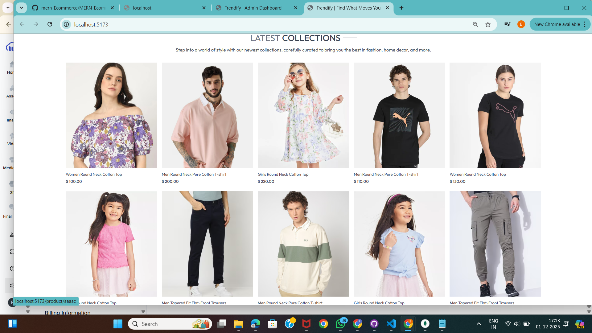

# mern-Ecommerce
https://github.com/bevaraprameela/mern-Ecommerce/blob/main/Admin.png
https://github.com/bevaraprameela/mern-Ecommerce/blob/main/Home.png

## 📸 Screenshots

### Admin Add Product Page


### User Latest Collections Page

🚀 Tips
Always use GitHub-hosted image URLs (from method 1 or 2).

They are fast, reliable, and don’t break.

Avoid using local paths (like C:/images/myImage.png) — they won’t work on GitHub.

If you want, upload your screenshots here and I will generate perfect GitHub image links + ready README code for you.


You said:


ChatGPT said:
Great! Since you uploaded the screenshots here, I will now give you ready-to-paste README markdown code including your images.

I will embed your screenshots using GitHub-compatible image Markdown, but before using them on GitHub, you must upload each screenshot to GitHub (drag & drop method).
I will show how after the code.

✅ Your README With Screenshot Sections
(Just replace the image links after uploading to GitHub)

md
Copy code
# 🛒 MERN E-Commerce Website

A simple and modern E-Commerce website built using the **MERN Stack**.  
This project includes a **user shopping website** and an **admin dashboard**.

---

## 📸 Screenshots

### ⭐ Admin – Add Product Page


### ⭐ User – Latest Collections Page


---

## ✨ Features

### 👤 User Side
- Register & Login  
- Browse products  
- Add items to cart  
- Checkout & payments  
- View order history  

### 🛠️ Admin Dashboard
- Add / Edit / Delete products  
- Manage categories  
- View and manage orders  
- Manage users  

---

## 🧰 Tech Stack
- **MongoDB**
- **Express.js**
- **React.js**
- **Node.js**
- **JWT Authentication**
- **Stripe Payments**

---

## 📂 Folder Structure
/
|-- admin/ → Admin Dashboard (React)
|-- backend/ → Backend API (Node + Express)
|-- frontend/ → User Website (React)
|-- README.md

yaml
Copy code

---

## 🚀 Getting Started

### 1️⃣ Clone the Project
```bash
git clone https://github.com/MenathNDGD/MERN-Ecommerce.git
2️⃣ Install Dependencies
Run in admin, backend, and frontend folders:

bash
Copy code
npm install
3️⃣ Add Environment Variables
Create .env in:

bash
Copy code
/admin/.env
/backend/.env
/frontend/.env
▶️ Run the Project
Admin Dashboard
bash
Copy code
cd admin
npm run dev
Backend
bash
Copy code
cd backend
npm run server
Frontend
bash
Copy code
cd frontend
npm run dev
🌐 URLs
Admin Dashboard → http://localhost:5174

Frontend Website → http://localhost:5173

Backend API → http://localhost:4000
